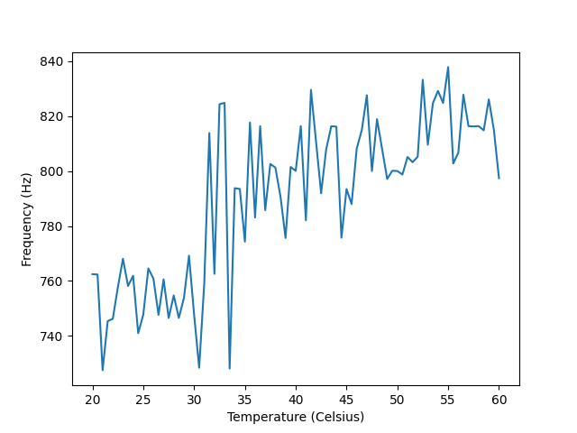
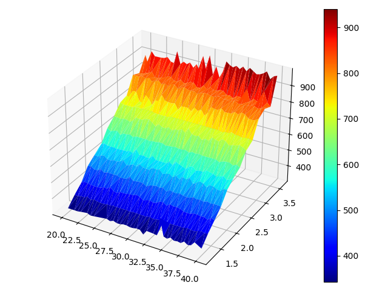

# AutoVCO
ML-Driven Adaptive Voltage Controlled Oscillator

Through this project, a VCO will be able to adjust its output frequency and account for minor changes in temperature and input voltage.

# Initial Analysis
## Temperature Independent Ideal Frequency

Let $V(t)$ be the voltage across capacitor $C_1$ with positive towards $V_2$. As $Q_1$ is assumed to be in the saturation region, current flows from $V_2$ to ground via resistor $R_1$ and capacitor $C_1$

$V(t) = V_{\infty} + [V_o - V_{\infty}]e^{-\frac{t}{RC}}$

On solving this, we get
$f = \frac{1}{T} = \frac{1}{2RCln(1 + \frac{V_i}{V_c})}$ where $V_i, V_c$ are the input and control voltages respectively.

# Data Analysis
Data was collected by simulating the circuit in MicroCap 12, with capacitance temperature coefficients optimized using Hooke's algorithm.
## Temperature Dependence

> Temperature (Celsius) on the x axis and output frequency (Hz) on the y axis
## Temperature and Voltage Dependence

> Temperature (Celsius) and control voltage (volts) on the horizontal plane, and output frequency (Hz) on the vertical axis

# Neural Network
Using these data points, we trained a neural network using [Tensorflow](https://www.tensorflow.org/).
- 3 hidden layers, 10 neurons each
- RELU activation function
- 500 epochs

This data was converted to a cpp header file for use inside [Arduino IDE](https://www.arduino.cc/en/software/) using [tinymlgen](https://github.com/eloquentarduino/tinymlgen).

# Hardware implementation
We built the VCO circuit on a PCB, connected to an ESP32 loaded with the trained neural network. We then verified that the frequency is, indeed, self adaptive by heating the circuit upto 45 degrees Celsius.

# Teammates
- [Moida Praneeth Jain](https://github.com/PraneethJain)
- [Harshvardhan Rana](https://github.com/harshvardhanrana)
- [Mohammed Faisal](https://github.com/JerseysGet)
- [Divyansh Jain](https://github.com/divyansh1702)
